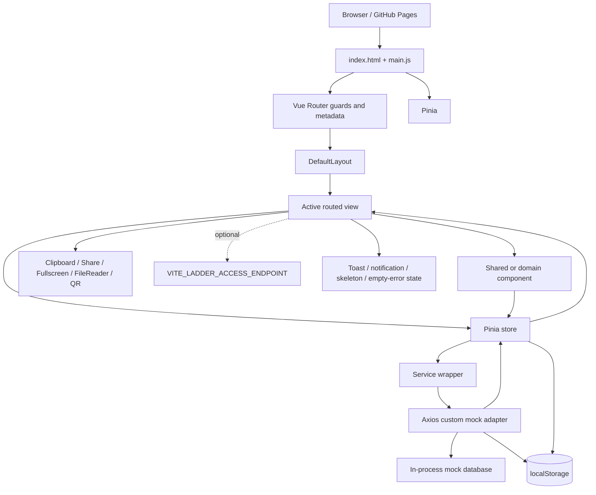

# GORRA - Technical Architecture

Status of this document: **Implemented** as a repository-grounded description of the current frontend prototype. Last verified on 2026-07-30.

Related documents: [product features and workflows](APP_FEATURES.md) and [UI psychology, motion, and visual discipline](docs/GORRA_UI_PSYCHOLOGY_AND_MOTION_SYSTEM.md).

## Status vocabulary

- **Implemented** - active and connected at runtime.
- **Partially implemented** - active connection exists, but an important part is missing or contradictory.
- **Prototype or mock** - browser-simulated infrastructure, not a production backend.
- **Planned** - direction or configuration without a complete active path.
- **Legacy or inactive** - not reached by the active router/import graph.
- **Needs verification** - the code does not establish one coherent intended behavior.

## Architecture summary and runtime status

GORRA is a Vue 3 single-page application built with Vite. Every route ultimately renders inside `DefaultLayout`; that layout changes presentation by route metadata so public, onboarding, friendly-match, immersive scoreboard, wide tournament, and standard app-shell pages feel different without separate root applications.

The active runtime is a local-first prototype:

- Vue Router provides public, member, club, challenge, friendly-match, tournament, match, and account routes.
- Pinia stores own reactive application state.
- Service wrappers call an Axios client with a custom in-process adapter.
- The adapter seeds and mutates player, ladder, match, tournament, and gallery records.
- Browser `localStorage` persists selected state, including the mock databases.
- Optional browser APIs support QR generation, sharing, clipboard, fullscreen, sound, and legacy hash navigation.
- One optional remote call exists for ladder creation access when `VITE_LADDER_ACCESS_ENDPOINT` is configured.

There is no production API, database, identity provider, tenant boundary, object store, queue, websocket, or server-side permission system. `VITE_API_BASE_URL` is assigned to the Axios instance, but the custom adapter handles the current requests locally.

## Source-of-truth hierarchy

When repository sources conflict, use this order:

1. `src/router/index.js` for reachability, route metadata, aliases, redirects, and guards.
2. `src/main.js`, `src/App.vue`, and `src/layouts/DefaultLayout.vue` for boot and shell behavior.
3. Active routed views and their imported components for visible behavior.
4. Pinia stores for state and action contracts.
5. Services and `src/services/ApiService.js` for mutation, validation, persistence, and mock endpoint behavior.
6. Config, composables, and utilities for business calculations and shared rules.
7. Global and component CSS for actual presentation.
8. These three core documents.
9. Other repository documents as history/reference only.

A file is not active simply because it exists. The active import chain is decisive.

## Reference Map

- `ARCH-BOOT` - `index.html`, `src/main.js`, `src/App.vue`, `src/utils/formSafety.js`, `src/assets/main.css`, `src/assets/tournament.css`.
- `ARCH-ROUTER` - `src/router/index.js`, `src/layouts/DefaultLayout.vue`, `src/components/RoutePageSkeleton.vue`, `src/components/compete/CompeteSectionShell.vue`.
- `ARCH-AUTH` - `src/views/LoginView.vue`, `src/stores/auth.js`, `src/composables/useAuth.js`, `src/utils/auth/accessControl.js`, `src/dataMode.js`, `src/router/index.js`.
- `ARCH-CLUB` - `src/stores/admin.js`, `src/services/AdminService.js`, `src/config/admin.js`, `src/utils/admin/clubSetup.js`, `src/views/ClubsView.vue`, `src/views/ClubView.vue`, `src/views/SettingsView.vue`, `src/views/MemberOnboardingView.vue`.
- `ARCH-LADDER` - `src/config/ladder.js`, `src/stores/player.js`, `src/stores/challenge.js`, `src/stores/match.js`, `src/services/PlayerService.js`, `src/services/ChallengeService.js`, `src/services/MatchService.js`, `src/services/LadderAccessService.js`, `src/services/ApiService.js`.
- `ARCH-FRIENDLY` - `src/stores/friendlyMatch.js`, `src/views/PlayHubView.vue`, `src/views/FriendlyMatchFlowView.vue`, `src/components/friendly/FriendlyMatchHome.vue`, `src/components/friendly/MatchResultModal.vue`.
- `ARCH-TOURNAMENT` - `src/stores/tournament.js`, `src/stores/tournamentGallery.js`, `src/services/TournamentService.js`, `src/services/TournamentImageService.js`, `src/services/ApiService.js`, `src/composables/useTournamentFixtures.js`, `src/composables/useTournamentStandings.js`, `src/composables/useBracketBuilder.js`, `src/composables/useTournamentLiveRefresh.js`, `src/utils/tournament/assignPlayersToCategories.js`, `src/utils/tournament/buildCategoryGroups.js`, `src/utils/tournament/buildTournamentPayload.js`, `src/utils/tournament/validateTournamentSetup.js`, `src/utils/tournament/tournamentFormatAdvisor.js`, `src/utils/tournament/categoryTemplates.js`.
- `ARCH-NOTIFY` - `src/stores/notification.js`, `src/views/NotificationsView.vue`, `src/components/ToastShelf.vue`, `src/utils/notificationSound.js`.
- `ARCH-UI` - `src/assets/main.css`, `src/assets/landing.css`, `src/assets/tournament.css`, `src/layouts/DefaultLayout.vue`, `src/components/EmptyState.vue`, `src/components/RoutePageSkeleton.vue`, `src/components/BaseButton.vue`, `src/components/BaseInput.vue`, `src/components/compete/TennisNavIcon.vue`, `src/components/friendly/FlowIcon.vue`.
- `ARCH-DEPLOY` - `package.json`, `vite.config.js`, `public/404.html`, `.github/workflows/deploy.yml`, `docs/GITHUB_PAGES_DEPLOYMENT_GUIDE.md`.

## Technology stack

| Layer | Technology | Runtime use | Status |
| --- | --- | --- | --- |
| UI | Vue `3.5.x`, Composition API, `<script setup>` | Views, components, layout | **Implemented** |
| State | Pinia `3.x` | Auth, club, player, challenge, match, friendly, tournament, gallery, notification, booking | **Implemented** |
| Routing | Vue Router `4.6.x` with `createWebHistory` | Route table, guards, metadata, redirects | **Implemented** |
| HTTP abstraction | Axios `1.6.x` | Custom local adapter; no current network API for core data | **Prototype or mock** |
| Charts | Chart.js `4.5.x`, vue-chartjs `5.3.x` | Dashboard performance chart | **Implemented** |
| QR | `qrcode` `1.5.x` | Club and play-now invitation images | **Implemented** client-side |
| Build | Vite `5.4.x`, Vue plugin | Dev/build/static assets | **Implemented** |
| Deployment | GitHub Pages, Actions, `gh-pages` script | Static production deployment | **Implemented**, configuration has caveats |
| Formatting | Prettier `3.8.x` | Source formatting script | **Implemented** tooling |

No TypeScript, test runner, linter script, server framework, schema ORM, or component library is configured in `package.json`.

## Boot sequence

Implementation: `ARCH-BOOT`, `ARCH-ROUTER`.

1. `index.html` exposes `#app` and loads `/src/main.js`; its static title is still `Vite App` until routing updates `document.title`.
2. `src/main.js` creates the Vue app from `src/App.vue`.
3. Pinia and Vue Router are installed.
4. `src/assets/main.css` and `src/assets/tournament.css` are imported globally.
5. `hardenFormSubmissions(document)` runs in the browser to reduce accidental form submissions.
6. A compatibility listener watches `window.location.hash`. If the hash contains a slash route, it replaces the current history route with that path.
7. The app waits for `router.isReady()`, performs one hash sync, and mounts.
8. `src/App.vue` renders `DefaultLayout` only.
9. `DefaultLayout` mounts the active `RouterView`, global toast shelf, route skeleton, shell chrome, active-club context, and account/navigation behaviors.
10. Router `afterEach` sets `document.title` to `<route title> | GORRA` and resets scroll.

Routing is browser-history mode, not hash history. Legacy hash URLs may still work through the custom sync bridge. GitHub Pages direct-route handling depends on `public/404.html` and its hardcoded `/tennis` repository path.

## System diagram



## Curated folder map

```text
src/
  main.js                 boot, plugins, hash compatibility, mount
  App.vue                 root layout only
  router/index.js         complete active route and guard table
  layouts/                shared shell and responsive navigation
  views/                  active and legacy routed-page candidates
    compete/              active Ladder, Challenges, Tournaments tabs
  components/             shared UI plus friendly/tournament domains
  stores/                 Pinia state and actions
  services/               wrappers plus Axios mock adapter
  composables/            auth helper and tournament calculations/refresh
  config/                 club setup and ladder rules
  utils/                  scoring, validation, sanitization, dates, invitations
  data/                   fresh-account ladder fixture generation
  assets/                 global, landing, and tournament styling
docs/                     supporting product, deployment, schema, and legacy handoff docs
public/                   favicon and GitHub Pages 404 redirect
.github/workflows/        Pages build/deploy workflow
```

Active competition views are the files under `src/views/compete/`, even though older similarly named views remain in `src/views/`.

## Layout and shell architecture

`src/App.vue` never swaps layouts. `DefaultLayout.vue` derives shell mode from route metadata and path/name:

| Mode | Trigger | Shell behavior |
| --- | --- | --- |
| Public | `meta.public` | No app sidebar/header/bottom navigation; full-width public content |
| Focused flow | `meta.friendlyFlow` or `meta.onboardingFlow` | No standard chrome; full-screen guided flow and shorter skeleton timing |
| Immersive | `meta.immersive` | No standard chrome; full-screen scoreboard |
| Standard app | Authenticated route without the above | Desktop/tablet sidebar, fixed header, content rail, mobile bottom nav |
| Wide tournament | Tournament creation/viewer routes | Wider content workspace; Players/Review creation steps can hide sidebar for their own side rail |

Shared primary navigation is Home, Play, Compete, Club. Compete supplies Ladder/Challenges/Tournaments tabs. Club supplies Overview/Members/Rules and role-sensitive Manage. Account menu supplies Profile, Match history, Account settings, and Club settings for managers.

The shell loads players and clubs on authenticated mount, manages active-club switching, exposes notification count, derives route-aware tournament titles/subtitles, schedules route-shaped skeletons (900 ms standard, 650 ms focused), and animates navigation from prior to next index.

Implementation: `ARCH-ROUTER`, `ARCH-CLUB`, `ARCH-NOTIFY`, `ARCH-UI`.

## Full active route map

All rows use `DefaultLayout`; “shell” describes which chrome it exposes. Unless marked Public, the global guard requires `authStore.isAuthenticated`.

### Public, entry, and redirects

| Path | Name / target | Component | Shell | Guard/metadata | Status |
| --- | --- | --- | --- | --- | --- |
| `/` | `Home` | `src/views/LandingView.vue` | Public | `public`; title only | **Implemented** |
| `/signin` (alias `/login`) | `SignIn` | `src/views/LoginView.vue` | Public | `public`, `authPage`, `authMode=signin` | **Prototype or mock** auth |
| `/signup` | `SignUp` | `src/views/LoginView.vue` | Public | `public`, `authPage`, `authMode=signup` | **Prototype or mock** auth |
| `/home` | redirect `Dashboard` | - | - | Redirect itself has no public flag | **Implemented** |
| `/compete` | redirect `Rankings` | - | - | Authenticated | **Implemented** |
| `/create-challenge` | redirect `/ladder-match/type?mode=ladder` | - | - | Preserves query | **Implemented** compatibility |
| `/:pathMatch(.*)*` | redirect `/dashboard` | - | - | Unauthenticated requests first go to sign-in | **Implemented** |

### Shared member/admin areas

| Path | Name | Component | Shell | Access and metadata | Status |
| --- | --- | --- | --- | --- | --- |
| `/dashboard` | `Dashboard` | `src/views/DashboardView.vue` | Standard | Auth; `primarySection=home` | **Implemented** |
| `/play` | `Play` | `src/views/PlayHubView.vue` | Standard | Auth; `primarySection=play` | **Implemented** |
| `/rankings` | `Rankings` | `src/views/compete/LadderView.vue` | Standard + Compete tabs | Auth; `primarySection=compete` | **Implemented** |
| `/challenges` | `Challenges` | `src/views/compete/ChallengesQueueView.vue` | Standard + Compete tabs | Auth; `primarySection=compete` | **Partially implemented** actions |
| `/tournaments` | `Tournaments` | `src/views/compete/TournamentsListView.vue` | Standard + Compete tabs | Auth; `primarySection=compete` | **Implemented** mock |
| `/club` | `Club` | `src/views/ClubView.vue` | Standard + Club context tabs | Auth; `primarySection=club`; `section` query selects overview/members/rules | **Implemented** local data |
| `/profile` | `Profile` | `src/views/ProfileView.vue` | Standard | Auth | **Implemented** mock |
| `/history` | `History` | `src/views/HistoryView.vue` | Standard | Auth | **Partially implemented** mixed sources |
| `/notifications` | `Notifications` | `src/views/NotificationsView.vue` | Standard | Auth | **Implemented** local |
| `/account/settings` | `AccountSettings` | `src/views/AccountSettingsView.vue` | Standard | Auth | **Prototype or mock** |
| `/matches/:matchId` | `MatchDetails` | `src/views/MatchDetailsView.vue` | Standard; Compete considered active | Auth; `props=true`; `matchId` param | **Partially implemented** ladder submission |
| `/play/:matchId` | `PlayMatch` | `src/views/PlayView.vue` | Immersive | Auth; active-club `matches.live_score`; `props=true`; `matchId`; `primarySection=play` | **Implemented** for managers; player path **Needs verification** |

### Club onboarding and management

| Path | Name | Component | Shell | Access and metadata | Status |
| --- | --- | --- | --- | --- | --- |
| `/onboarding/join-club` | `PlayerClubJoin` | `src/views/MemberOnboardingView.vue` | Focused onboarding | Auth; `onboardingFlow`; `primarySection=club`; query `club/invite` | **Partially implemented**, visual join only |
| `/admin/setup` | `AdminSetup` | `src/views/ClubsView.vue` | Focused onboarding | Auth; global `club.manage`; query `view/step/invite` | **Prototype or mock** |
| `/clubs` | `Clubs` | `src/views/ClubsView.vue` | Focused onboarding | Auth; global `club.manage`; query-driven create/join/switch | **Prototype or mock** |
| `/settings` (alias `/club/settings`) | `Settings` | `src/views/SettingsView.vue` | Standard + Club Manage context | Auth; active-club `club.manage`; `primarySection=club` | **Prototype or mock** |

### Friendly and ladder focused flow

All rows render `src/views/FriendlyMatchFlowView.vue`, use `meta.friendlyFlow=true`, set `primarySection=play`, and use `meta.friendlyStep` as the screen state.

| Path (legacy alias where present) | Name | Step | Parameters/role | Status |
| --- | --- | --- | --- | --- |
| `/friendly-match/type` (`/ladder-match/type`) | `FriendlyMatchType` | `type` | Query `mode=ladder` selects ladder | **Implemented** |
| `/friendly-match/timing` (`/ladder-match/timing`) | `FriendlyMatchTiming` | `timing` | Guarded by selected type | **Implemented** |
| `/friendly-match/join` (`/ladder-match/join`) | `FriendlyMatchJoin` | `join` | Creator QR/link waiting screen | **Prototype or mock** |
| `/friendly-match/club-opponent` (`/ladder-match/opponent`) | `FriendlyMatchClubOpponent` | `clubOpponent` | Hardcoded/local opponent list | **Prototype or mock** |
| `/friendly-match/schedule` (`/ladder-match/schedule`) | `FriendlyMatchSchedule` | `schedule` | Optional date/time/court | **Implemented** locally |
| `/friendly-match/opponent` | `FriendlyMatchOpponent` | `opponent` | Guard redirects to club-opponent screen | **Legacy-compatible route** |
| `/friendly-match/scoring` (`/ladder-match/scoring`) | `FriendlyMatchScoring` | `scoring` | Friendly scoring mode; ladder skips it | **Implemented** |
| `/friendly-match/format` (`/ladder-match/format`) | `FriendlyMatchFormat` | `format` | Preset/saved format review | **Implemented** |
| `/friendly-match/custom-format` | `FriendlyMatchCustomFormat` | `customFormat` | Friendly only | **Implemented** locally |
| `/friendly-match/scheduled` (`/ladder-match/sent`) | `FriendlyMatchScheduled` | `scheduled` | Confirmation/status | **Partially implemented** acceptance |
| `/friendly-match/join/:token` (`/ladder-match/join/:token`) | `FriendlyMatchJoinInvitation` | `externalJoin` | Auth required; `token` param | **Prototype or mock** |
| `/friendly-match/live` (`/ladder-match/live`) | `FriendlyMatchLive` | `live` | Focused + `immersive`; local draft-owner scoring | **Implemented** locally |

### Tournament workspace

| Path | Name | Component | Shell | Access, parameters, metadata | Status |
| --- | --- | --- | --- | --- | --- |
| `/tournaments/create` | `TournamentCreate` | `src/views/TournamentCreate.vue` | Wide; Players/Review own side rail | Auth; active-club `tournaments.manage`; query `step`; `primarySection=compete` | **Implemented** mock |
| `/tournaments/:tournamentId` | `TournamentOverview` | `src/views/TournamentOverview.vue` | Wide viewer | Auth; `tournamentId`; `primarySection=compete` | **Implemented** mock |
| `/tournaments/:tournamentId/category/:categoryId` | `TournamentCategory` | `src/views/TournamentCategory.vue` | Wide viewer | Auth; two params; `primarySection=compete` | **Implemented** mock |
| `/tournaments/:tournamentId/schedule` | `TournamentSchedule` | `src/views/TournamentSchedule.vue` | Wide viewer | Auth; `tournamentId`; `primarySection=compete` | **Implemented** mock |
| `/tournaments/:tournamentId/gallery` | `TournamentGallery` | `src/views/TournamentGallery.vue` | Wide viewer | Auth; `tournamentId`; query `folder/image`; `primarySection=compete` | **Implemented** local gallery |
| `/tournaments/:tournamentId/match/:matchId` | `TournamentMatchDetails` | `src/views/MatchDetailsView.vue` | Wide viewer | Auth; two params; `props=true`; `primarySection=compete` | **Implemented** mock |

## Authentication, role resolution, and authorization

Implementation: `ARCH-AUTH`, `ARCH-CLUB`, `ARCH-ROUTER`.

### Session and identity

`auth` loads `sheltennis-auth` at store creation and watches login/user to persist it. Login uses `fakeRequest()`, builds a hardcoded player/admin identity, selects empty/demo mode, and attaches a role access profile. `player.currentPlayerId` resolves from `auth.user.playerId`, falling back to `player-02`.

Active login offers `player` and `club_admin`. `tournament_admin` and `super_admin` exist in access control but are not offered. `LOCAL_ADMIN_PLAYER_IDS` also promotes `player-02` to super admin when no explicit role wins, which is prototype coupling.

### Two role systems

- Global access roles: `player`, `tournament_admin`, `club_admin`, `super_admin` with permission arrays.
- Per-club membership roles: `player`, `co-admin`, `admin` stored in the club directory.

`admin.hasActiveClubPermission()` grants a small read/player set to any active membership and manager permissions only to admin/co-admin. This active-club result is used for club settings, tournament management, scoring, images, and live score routes.

### Guard order

1. Non-public route without auth -> `SignIn?redirect=<fullPath>`.
2. Global admin on a route other than AdminSetup/Clubs -> load clubs; if no configured active club, redirect into setup/recovery.
3. `meta.activeClubPermission` -> ensure active club and require active-club permission; failure goes to Dashboard with `access=club/admin`.
4. Other `meta.permission` -> require global permission; failure goes to Dashboard with `access=admin`.

Read routes such as Ladder and Tournaments do not apply their nominal view permissions. The `tournament_admin` role can enter the global-admin setup redirect but lacks global `club.manage`, producing a possible redirect loop when unconfigured. **Needs verification**.

Authorization is enforced only in browser code. AdminService repeats club membership/manager checks for local directory operations, and the ladder mock adapter checks participant actor IDs. Tournament mutation handlers do not check actor authority. None of these are production security boundaries.

## Active club context

`admin` derives the actor from auth identity, loads the local club directory, resolves memberships, and exposes `activeClubId`, active membership/role, permission checks, configured state, and active ladders. `DefaultLayout` presents the active club, switches it through AdminService, and uses it for role-sensitive navigation.

The context is incomplete at the domain level: player, challenge, match, and tournament mock records are not consistently keyed or filtered by active club. Switching clubs changes shell/settings context and permissions but does not reliably switch competition datasets. Player onboarding also does not write a membership. Status: **Partially implemented**. Implementation: `ARCH-CLUB`, `ARCH-LADDER`, `ARCH-TOURNAMENT`.

## Store and service map

| Store | Responsibility and state/actions | Service/persistence | Main consumers | Limitation |
| --- | --- | --- | --- | --- |
| `auth` (`src/stores/auth.js`) | Session, user, loading/message, access profile, login/logout | `fakeRequest`; `sheltennis-auth` | Router, layout, login, player/admin stores, settings | Hardcoded identities; stale naming; no credential authority |
| `admin` (`src/stores/admin.js`) | Clubs, memberships, active club, setup draft, manager permissions; load/save/join/switch/invite | `AdminService.js`; directory/setup localStorage | Router, layout, Clubs/Club/Settings, tournament UI | Local tenancy only; player onboarding disconnected |
| `player` (`src/stores/player.js`) | Roster, current player, sorted ladder, category rosters, eligible opponents, role overrides | `PlayerService` -> mock adapter; role override key | Dashboard, Ladder, challenge/match/tournament views | One global roster; active club/ladders not selected |
| `challenge` (`src/stores/challenge.js`) | Challenge list/filter/counts; create/accept/decline/withdraw/review | `ChallengeService` -> mock adapter -> ladder key | Dashboard, queue, focused ladder flow | Confirm/withdraw actions not exposed in active queue |
| `match` (`src/stores/match.js`) | Shared match list, scheduled/review lookups, patch/live state/result | `MatchService` -> mock adapter -> ladder/tournament keys | Dashboard, Play, details, tournament | Ladder result callers inconsistently supply `submittedBy` |
| `friendlyMatch` (`src/stores/friendlyMatch.js`) | Draft/invitations/formats/results; join, score, undo, finish | Four GORRA localStorage keys | Play hub/focused flow | Separate domain from shared matches; hardcoded opponents |
| `tournament` (`src/stores/tournament.js`) | Tournament list/active event, standings, champion, fixtures, stage close, scores, schedules | `TournamentService` + match store -> tournament key | Dashboard and tournament routes | Local polling/concurrency; active club not attached |
| `tournamentGallery` (`src/stores/tournamentGallery.js`) | Image list and CRUD state | `TournamentImageService` -> tournament key | Gallery | Data URLs/local quota, no object store |
| `notification` (`src/stores/notification.js`) | Persistent feed, transient toasts, score-event dedupe | Mode-aware localStorage; optional audio | Layout, dashboard, actions, notification view | Browser/profile scoped, not account/server scoped |
| `booking` (`src/stores/booking.js`) | Bookings/slots and overlap-aware booking | `BookingService`; `sheltennis-bookings[.empty]` | Dashboard/history; inactive Book view | No active booking route |
| `counter` (`src/stores/counter.js`) | Scaffold counter | Memory | None active | **Legacy or inactive** |

Service wrappers are intentionally thin. `ApiService.js` owns most mock validation, data creation, endpoint routing, ranking changes, tournament progression, and persistence. `AdminService.js` is a separate local directory service and does not use Axios. `LadderAccessService.js` is local by default and optionally calls a configured remote eligibility endpoint.

## Composables and utilities

| File/system | Responsibility | Consumers/status |
| --- | --- | --- |
| `src/composables/useAuth.js` | Thin computed facade over auth store | Present; limited active use |
| `useTournamentFixtures.js` | Generate round-robin fixtures | Mock adapter/tournament lifecycle; **Implemented** |
| `useTournamentStandings.js` | Calculate group standings/tiebreak order | Store/adapter/tables; **Implemented** |
| `useBracketBuilder.js` | Empty/generate/progress knockout structures | Adapter/tournament UI; **Implemented** |
| `useTournamentLiveRefresh.js` | Poll tournament/match data | Tournament overview/category/schedule/details; **Prototype or mock** |
| `utils/tennisScoring.js` | Shared scoreboard state and point rules | Routed Play view; **Implemented** |
| `config/ladder.js` | Eligibility, movement, locked match config, deadlines | Ladder/challenge/friendly/API; club override **Partially implemented** |
| `utils/tournament/*` | Category assignment, group building, payload, setup validation, format advice/templates | Tournament creation; **Implemented** |
| `utils/formSafety.js` | Sanitization, safe URL/image checks, submission hardening | Boot, settings, gallery, services; **Implemented** client-side |
| `utils/onboarding/*` | Club invitation display search/validation and roster parsing/import validation | Onboarding/admin/settings; mixed prototype paths |

## Domain models

No TypeScript interfaces are defined; shapes are JavaScript objects normalized at store/service boundaries.

- **Auth user:** `name`, `email`, `playerId`, `roleKey`, `roles`, `permissions`, `isAdmin`, `lastLogin`, `avatar`. Source: `ARCH-AUTH`.
- **Club directory:** schema version, clubs, memberships, per-user active club, per-user drafts. Club setup contains workspace, membership/invites/roster, ladders, placement, rules, status/timestamps. Source: `ARCH-CLUB`.
- **Player:** `id`, `name`, image, rank/ladder metadata, wins/losses/matches, category/gender/veteran metadata. Source: `ARCH-LADDER` and `ApiService.js`.
- **Challenge:** participants, scorer, type/scope, status, requested/accepted/declined/cancelled/confirmed timestamps, response/play deadlines, pre-match positions, ladder/match-config snapshots, note. Source: `ARCH-LADDER`.
- **Shared match:** ladder fields (`challengeId`, challenger/defender) or tournament fields (`tournamentId`, category/group/stage, player1/player2), schedule/court, status, score/winner, sets/games, `liveState`, timestamps. Source: `ARCH-LADDER`, `ARCH-TOURNAMENT`.
- **Friendly draft/invitation/result:** separate local type/timing/opponent/schedule/format/score/ownership/token/status fields. Source: `ARCH-FRIENDLY`.
- **Tournament:** basics/status/dates/officials/rules, categories/groups/knockout, images, timestamps. Source: `ARCH-TOURNAMENT`.
- **Notification:** ID, title/message/type/time/read, optional event key/meta. Source: `ARCH-NOTIFY`.
- **Booking:** ID, date/start/duration/player/description/createdAt. Source: inactive booking subsystem.

Status strings are domain-specific. Do not normalize `pending` tournament fixtures, `scheduled` ladder matches, `waiting_*` friendly invitations, and `pending_review` ladder results into one state without an explicit migration.

## Major data flows

### Club setup and switching

```text
Admin action
-> ClubsView / SettingsView / DefaultLayout
-> admin store
-> AdminService
-> validate actor, membership, setup, invite
-> gorra.admin.clubDirectory.v2 (+ legacy setup mirror)
-> store reloads active club/memberships
-> shell/context/toast updates
```

### Ladder challenge and confirmation

```text
Player action
-> FriendlyMatchFlowView or ChallengesQueueView
-> challenge store
-> ChallengeService
-> Axios mock adapter
-> validate ladder/actor/status/deadline
-> tennis.mock.ladderState.v1
-> challenge/match/player state update
-> toast/queue/ladder refresh
```

Result submission requires `submittedBy`; confirmation requires the other participant. Active UI coverage is incomplete, as documented in [features](APP_FEATURES.md).

### Live scoreboard

```text
Point action
-> PlayView + TennisScoreboard
-> tennisScoring utility
-> matchStore.saveLiveState
-> MatchService PATCH /matches/:id
-> mock adapter + ladder/tournament localStorage
-> match store
-> persisted scoreboard and UI clocks/status
```

Focused friendly scoring instead deep-watches `friendlyMatch.draft` directly to its own localStorage key.

### Tournament create and progression

```text
Manager input
-> TournamentCreate
-> assignment/group/format/validation utilities
-> tournament store
-> TournamentService
-> mock adapter
-> tournament record + generated shared matches
-> tennis.mock.tournamentState.v1
-> tournament/match stores
-> overview/category/schedule/bracket feedback
```

Score entry can update group standings or progress knockout participants. Live-refresh composables poll the same local adapter.

### Notification flow

```text
Domain action or observed score change
-> notification store
-> event-key/signature dedupe
-> mode-specific notification localStorage
-> header unread state + Dashboard feed + NotificationsView
-> read/dismiss/clear mutation
```

## Persistence architecture

| Key | Owner | Contents | Scope/problem |
| --- | --- | --- | --- |
| `sheltennis-auth` | auth store | Session/user | Stale name; local and forgeable |
| `gorra.appDataMode.v1` | data mode | `empty`/`demo` | Correct GORRA key |
| `gorra.admin.clubDirectory.v2` | AdminService | Clubs, memberships, active club, drafts, private invites | Local tenant prototype |
| `gorra.admin.clubSetup.v1` | AdminService/config | Legacy mirror | Ladder reader expects schema 1 while current setup schema is 2 |
| `tennis.mock.ladderState.v1` | mock adapter | Players, challenges, ladder matches/live state | Not club- or mode-scoped |
| `tennis.mock.tournamentState.v1` | mock adapter | Tournaments, matches, gallery | Not club- or mode-scoped; data URLs can be large |
| `gorra.friendlyMatch*.v*` | friendly store | Draft, invites, results, formats | Separate competition silo |
| `tennis.local.notifications.v1[.empty]` | notification store | Feed | Mode-aware, not user-aware |
| `tennis.local.matchEventSignatures.v1[.empty]` | notification store | Dedup signatures | Mode-aware, not user-aware |
| `tennis.local.playerRoles.v1` | player store | Role overrides | Prototype only |
| `sheltennis-bookings[.empty]` | booking store | Bookings | Stale name; inactive route |

The mock adapter loads state lazily and holds a module-level database. Fresh mode filters ladder records by an account scope and returns no tournaments; demo mode reads all stored records. Because the storage keys are shared, demo can observe fresh-mode records. Status: **Needs verification**.

## External integrations and browser APIs

- Cloudinary profile/tennis images and Unsplash tournament seeds: remote visual assets, not application data APIs.
- Google Fonts imports: active CSS fetches Poppins and DM Sans; system fallbacks apply offline.
- `ui-avatars.com`: auth prototype avatar URL.
- Optional `VITE_LADDER_ACCESS_ENDPOINT`: POST with credentials for eligibility; local check remains default.
- `navigator.clipboard`, Web Share, Fullscreen, FileReader/object URLs, `window.confirm`, Web Audio, and QR canvas/data URL generation.
- GitHub Pages and GitHub Actions static deployment.

No Cloudinary upload API, email/SMS provider, push provider, payment provider, analytics SDK, or realtime service is connected.

## UI and responsive implementation layer

Implementation: `ARCH-UI` and the canonical [UI psychology document](docs/GORRA_UI_PSYCHOLOGY_AND_MOTION_SYSTEM.md).

- `main.css` defines shared color, weight, radius, border, motion, focus, button, card, and skeleton tokens; its base body font is Inter/system.
- `DefaultLayout.vue` applies Poppins to the active shell, fixed header/sidebar, 220 px desktop and 76 px tablet sidebar, mobile bottom navigation, 85% mobile content rail, contextual navigation, skeleton overlay, and reduced-motion overrides.
- `tournament.css` applies DM Sans/Poppins to tournament workspace rules.
- `landing.css` owns public presentation and uses mixed Inter/Poppins variables.
- Views/components add scoped responsive rules; tournament brackets have desktop/mobile variants.
- `RoutePageSkeleton.vue` maps route names/steps to destination-shaped skeletons and disables shimmer for reduced motion.
- `EmptyState.vue`, tournament empty state, ToastShelf, BaseButton/BaseInput, FlowIcon, and TennisNavIcon supply shared patterns, though older views still contain one-off UI.

The intended system is cohesive, but typography and some radii/shadows remain inconsistent between global, shell, tournament, auth/onboarding, and legacy components.

## Deployment and configuration

Implementation: `ARCH-DEPLOY`.

- `npm run build` runs Vite; `npm run deploy` builds and publishes `dist` through `gh-pages`.
- The GitHub Actions workflow on `main` runs Node 20, `npm ci`, build, Pages artifact upload, and deployment.
- Vite production base is `/<GITHUB_REPOSITORY name>/`, defaulting to `/tennis/`.
- `package.json.homepage` and `public/404.html` are hardcoded to the `tennis` repository path.
- Router uses browser history with `import.meta.env.BASE_URL`; `404.html` redirects deep links back to `/<repo>/?redirect=...`.
- The app does not read the `redirect` query produced by `404.html`; `main.js` only synchronizes a slash path from `location.hash`. Direct-route recovery therefore **Needs verification**.
- `index.html` favicon path is absolute `/favicon.ico`, which may miss the Vite base on Pages. **Needs verification**.

Environment variable recognized in active code:

- `VITE_LADDER_ACCESS_ENDPOINT` - optional remote ladder eligibility check.
- `VITE_API_BASE_URL` - Axios base URL value, though the custom adapter still handles core calls.

## Technical mismatches and production-readiness gaps

1. Prototype login can create privileged roles without authentication; localStorage is forgeable.
2. No server authorization, tenant filtering, transaction, audit trail, rate limit, or concurrency control exists.
3. Player onboarding success does not create a club-directory membership.
4. Active-club switch is not propagated as a filter/key to player, ladder, match, or tournament data.
5. Setup schema v2 conflicts with the ladder config reader's schema-v1 condition.
6. `tournament_admin` can encounter a setup/dashboard redirect loop and is not selectable.
7. Player Play hub and `/play/:matchId` permissions disagree.
8. Ladder Match Details and Play result submissions omit `submittedBy`; focused ladder finish includes it.
9. Result confirmation and withdraw exist in services but are absent from the active challenge queue.
10. Scheduled friendly invitation acceptance is not connected.
11. Data-mode persistence is only partially scoped; gallery and competition state can leak across local modes/users/clubs.
12. Tournament adapter mutation endpoints trust UI checks.
13. Gallery upload stores base64 data in localStorage; there is no remote file lifecycle.
14. Polling every two seconds substitutes for realtime updates and may overwrite local state in future multi-user use.
15. Password update is a timeout only; account/profile changes mutate local auth state.
16. Package/index/storage/copy/deployment paths retain `tennis`, `sheltennis`, ShellTennis, or Vite names.
17. No automated tests, lint command, production monitoring, or typed contracts are configured.

## Legacy or inactive code

| Files | Classification/reason |
| --- | --- |
| `src/views/RankingsView.vue`, `ChallengesView.vue`, `TournamentHub.vue` | **Legacy or inactive** alternatives; router uses `views/compete/*` |
| `src/views/CreateChallengeView.vue` | **Legacy or inactive**; route redirects to focused flow |
| `src/views/AdminSetupView.vue`, `PlayerClubJoinView.vue` | **Legacy or inactive**; router uses ClubsView/MemberOnboardingView |
| `src/views/BookView.vue`, `MatchesView.vue` | **Legacy or inactive**; no routes; Matches expects nonexistent store APIs |
| `src/components/NavBar.vue`, `ChallengeCard.vue`, `PlayerCard.vue`, `RankingRow.vue`, `CourtBookingForm.vue`, `CountdownTimer.vue` | Older paths or inactive unless imported by an active file |
| `src/stores/counter.js` | Scaffold demo |
| `styling.md`, `logic.md`, older ShellTennis/RSP handoffs | Reference/history; not runtime truth |

## Architecture handoff rule

For a new change, trace route -> layout mode -> active view/component -> store/composable -> service -> adapter/storage -> state update -> feedback. Confirm both global role and active-club role where relevant. Do not infer production security or server persistence from local guards, Axios-shaped calls, or durable localStorage.
